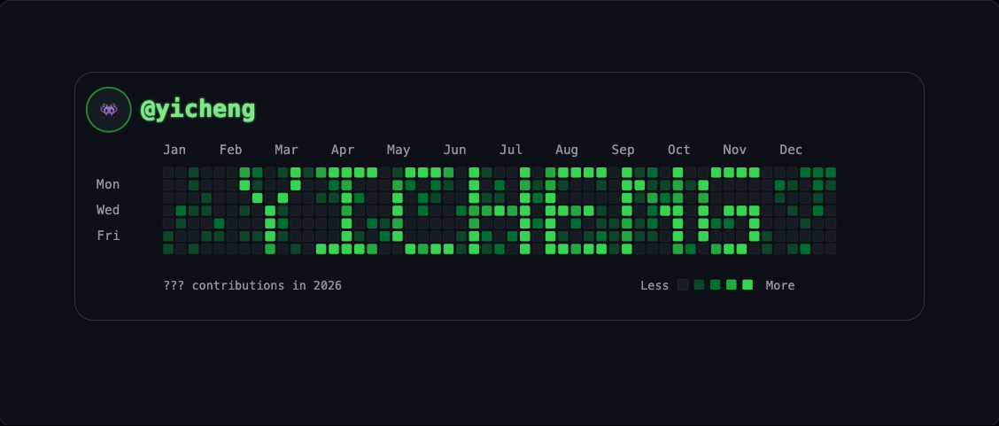
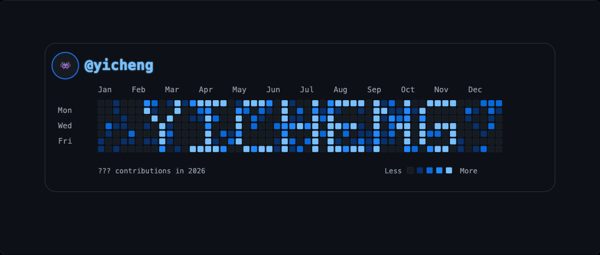
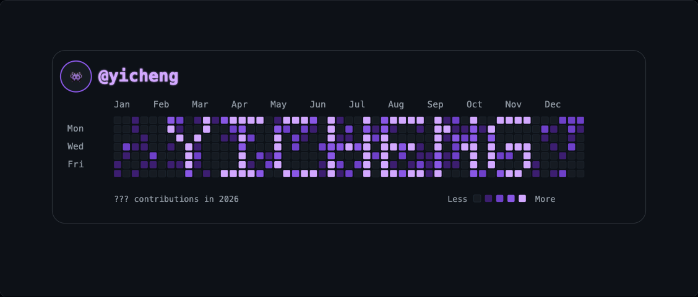
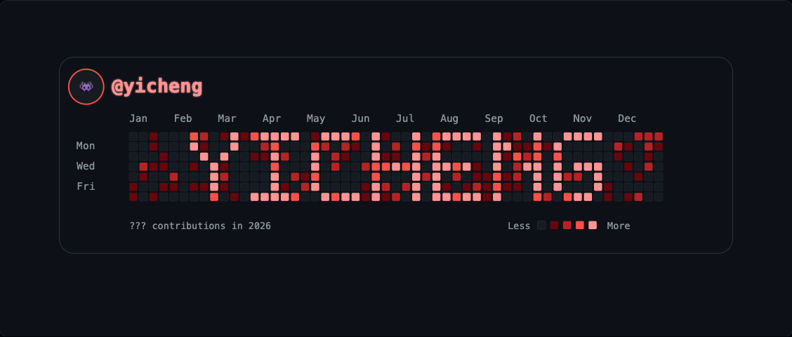
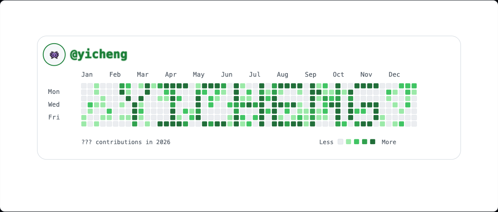

<h1 align="center">Contribution Banner Generator</h1>

<p align="center">
  Turn your name into a GitHub-style contribution graph — sized and cropped for an X (Twitter) profile banner.
</p>

<p align="center">
  
</p>

<p align="center">
  <a href="#quick-start">Quick start</a> ·
  <a href="#usage">Usage</a> ·
  <a href="#themes">Themes</a> ·
  <a href="#how-it-works">How it works</a>
</p>

---

A small, dependency-light React + Vite app. Type a word, pick a theme, and export a crisp banner as **SVG** or **PNG** (or copy it straight to your clipboard). Everything runs locally in the browser — nothing is uploaded anywhere.

## Themes

Six palettes, each recoloring the whole card — grid, handle, avatar ring, and legend.

| | |
|---|---|
| **Classic**  | **Ocean**  |
| **Grape**  | **Sunset**  |
| **Light**  | |

## Quick start

This project uses [pnpm](https://pnpm.io/) (a `pnpm-lock.yaml` is committed).

```bash
pnpm install
pnpm dev
```

Then open the local Vite URL it prints (usually `http://localhost:5173`).

> Using npm or yarn instead? `npm install && npm run dev` works too — it'll just generate its own lockfile.

## Usage

1. **Text in graph** — the word rendered into the grid (A–Z, 0–9, up to ~8 characters).
2. **Handle** — the `@name` shown next to your avatar.
3. **Year** — the label in the footer line.
4. **Theme** — click a swatch to recolor the banner.
5. **Background density** — slide to make the surrounding "noise" cells sparse or busy.
6. **Profile pic** — upload an image for the avatar (otherwise a 👾 placeholder is used).
7. **Shuffle** — reroll the random background pattern.
8. **Export** — **Copy PNG** to clipboard, or download as **SVG** / **2× PNG**.

PNG export gives the cleanest result for uploading to X.

## How it works

Each character is defined as a `5×7` pixel glyph in [`src/glyphs.js`](src/glyphs.js). The text is centered into a `53 × 7` grid (the same dimensions as a real GitHub contribution graph — 53 weeks by 7 days), lit cells become bright contribution squares, and the rest of the grid is filled with seeded random "noise" so it reads like a genuine activity graph. The whole thing is drawn as a single self-contained SVG, which is what gets exported.

## Project structure

| File | Responsibility |
| --- | --- |
| [`src/glyphs.js`](src/glyphs.js) | 5×7 pixel font and text-to-grid rendering |
| [`src/grid.js`](src/grid.js) | Seeded noise and grid building |
| [`src/themes.js`](src/themes.js) | Color palettes |
| [`src/Banner.jsx`](src/Banner.jsx) | The exported banner SVG |
| [`src/App.jsx`](src/App.jsx) | Controls, state, and export actions |

## Notes & limitations

- Text is intentionally limited to ~8 characters — a real contribution graph is only 53 columns wide.
- The font covers uppercase `A–Z`, digits `0–9`, and spaces.
- The footer reads `??? contributions in <year>` by design (the count is a stylistic placeholder, not a real total).

## Tech

React · Vite · [lucide-react](https://lucide.dev/) icons. No backend, no tracking.
